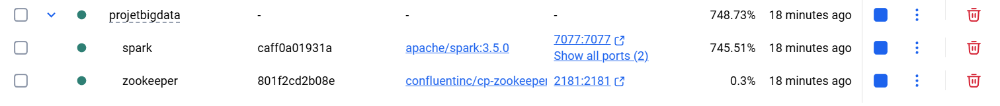
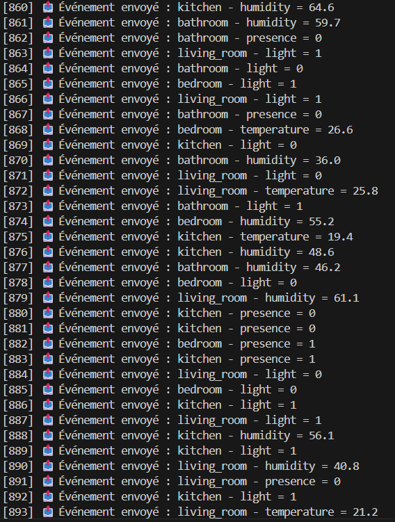
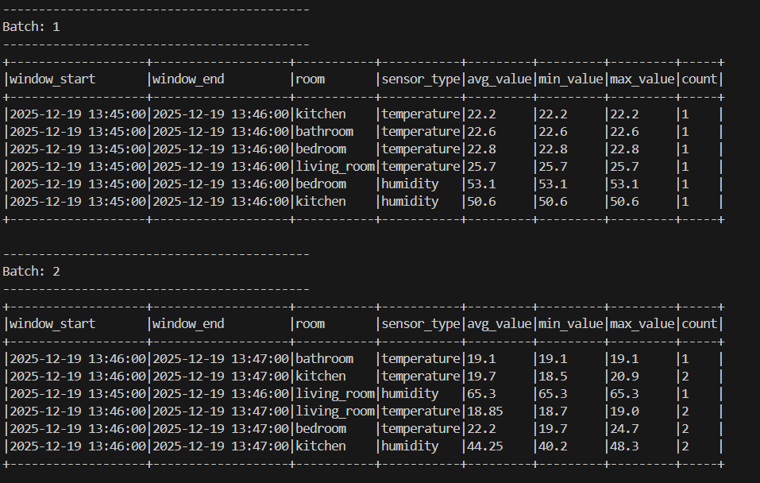
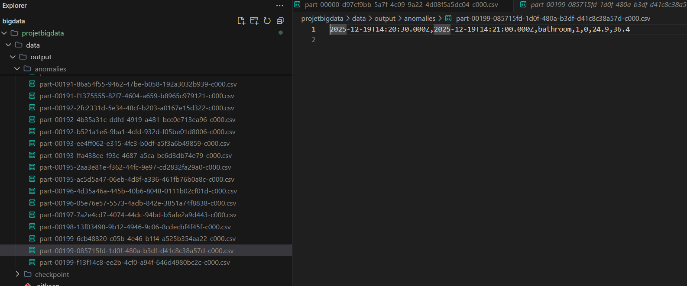

# BIG DATA PROJECT: Smart Home IoT Analysis

This file is the central document of **our project**. It contains:
1.  **Simple explanation** of the project (What is it? What purpose does it serve?).
2.  **Execution Guide** (All commands to launch the project).
3.  **Proof of Operation** (Screenshots and detailed technical explanations).
4.  **Compliance** (Proof that **we respected** the guidelines for Option A).

---

# 1. 🎓 What is this project? (Simple Explanation)

Imagine that we want to monitor a "Smart Home"  to detect problems (like a forgotten light or abnormal temperature) in real-time.

To do this, **we built** a "data factory" with 3 actors:

1.  **The Producer (Python)**: It acts like **virtual sensors** in the house. It generates fake events (Temperature 25°C, Light On...) and sends them very quickly.
2.  **Kafka (The Mailman)**: It is the **transport pipe**. It receives messages from sensors and keeps them safe while waiting for them to be processed.
3.  **Spark (The Brain)**: It is the **analyzer**. It reads messages arriving through the pipe, calculates statistics (averages per minute), and monitors anomalies to alert us.

**Project Interest**:
It proves that we know how to handle "Streaming Data" (which never stops arriving), exactly as Uber, Netflix, or banks do today.

---

# 2. 💻 Execution Guide: Copy-Paste Commands

Here is the exact list of commands to launch and test the project yourself.

## Step 1: Clean everything (optional, to start from scratch)
If you want to be sure everything is clean:
```powershell
docker-compose down
# Removes volumes (data) to start fresh
docker volume prune -f
```

## Step 2: Launch the infrastructure (Docker)
Open a terminal (PowerShell or CMD) at the project root (`c:\bigdata\projetbigdata`).
```powershell
docker-compose up -d
```
*Wait 30 seconds for everything to start.*

Verify that it is running:
```powershell
docker ps
```
*You should see 3 lines: zookeeper, kafka, spark.*

## Step 3: Create the discussion subject (Kafka Topic)
We tell Kafka to create the "home_sensors" channel.
```powershell
docker exec kafka kafka-topics --create --topic home_sensors --bootstrap-server kafka:9092 --partitions 1 --replication-factor 1
```

## Step 4: Launch the Producer (The Data)
Open a **SECOND** terminal.
We secured the execution with a virtual environment.

```powershell
# 1. Create the virtual environment (only once)
python -m venv venv

# 2. Activate the environment
.\venv\Scripts\Activate

# 3. Install dependencies
pip install -r requirements.txt

# 4. Launch the producer (wait 30 seconds after execution of this command)
python producer/sensor_producer.py
```
*Leave this terminal open! You will see messages scrolling.*

## Step 5: Launch Spark Analysis
Open a **THIRD** terminal.
We launch Spark inside Docker to avoid Windows bugs.

```powershell
docker exec spark /opt/spark/bin/spark-submit --conf spark.jars.ivy=/tmp/.ivy2 --packages org.apache.spark:spark-sql-kafka-0-10_2.12:3.5.0 --master local[*] /home/spark_jobs/spark_streaming_analysis.py
```
*You will see a lot of text scrolling, this is normal. After a moment, you will see tables displayed every minute.*

## Step 6: Verify results
If you want to see if anomalies were detected, go to your windows folder:
`c:\bigdata\projetbigdata\data\output\anomalies`
You will find CSV files there.

---

# 3. 📸 Explanation of Proofs (Screenshots)

Here is the technical analysis of what you see on **our screenshots**.

## DOCKER DISPLAY TO HAVE: 

## 🟢 SCREEN 1: The "Producer" Terminal (Data Generation)


**Title: Real-Time IoT Sensor Simulation**

**What we see:**
A Python script generating and sending events continuously, about every 2 seconds. Each line represents a sensor reading sent.

**How it works (Code logic):**
The `sensor_producer.py` script acts as a smart home simulator.
1.  **Randomness**: At each execution, it randomly chooses:
    -   A **Room** among 4: `living_room`, `bedroom`, `kitchen`, `bathroom`.
    -   A **Sensor Type** among 4: `temperature`, `humidity`, `presence`, `light`.
2.  **Realistic Values**: The data is not random nonsense; it follows logical rules defined in the code:
    -   *Temperature*: Between 18°C and 28°C.
    -   *Humidity*: Between 30% and 70%.
    -   *Presence/Light*: Binary (0 or 1).
3.  **Sending to Kafka**: Once the event is created (JSON format), it is "pushed" instantly to the Kafka Topic `home_sensors` which acts as our data transport pipe.

**Why?**
This proves that **our system** is capable of ingesting dynamic and non-static data, simulating an unpredictable real environment.

---

## 🔵 SCREEN 2: The "Spark" Terminal (Batch Processing)



**Title: Streaming Aggregation and Analysis (Micro-Batches)**

**What we see:**
ASCII tables generated by Spark updating. Each table corresponds to a "Batch" (a processing lot).

**How it works (Code logic):**
Spark Streaming listens to the Kafka Topic and does not process messages one by one, but by packets (micro-batches).
1.  **Windowing**: The code uses a `window` function. This means it groups all data received during a precise period (**1 minute**).
2.  **Aggregation**: For each window and each room, it calculates statistics:
    -   `avg_value`: The average (e.g., average temperature).
    -   `min/max`: Value peaks (minimum and maximum).
    -   `count`: The number of readings received.
3.  **"Update" Mode**: The table you see only displays lines that were *modified* during the last micro-batch. This is why the table size changes constantly: if only kitchen sensors sent data this second, only the "kitchen" line appears.

**Why?**
This demonstrates Spark's capability to transform chaotic raw data into structured and useful statistical information, in near real-time.

---

## 🔴 SCREEN 3: "Anomalies" Files (Alerting)

*Anomaly example: 2025-12-19T13:48:30.000Z,2025-12-19T13:49:00.000Z,kitchen,0,0,,59.55*
*Anomaly example: 2025-12-19T14:20:30.000Z,2025-12-19T14:21:00.000Z,kitchen,1,0,23.3,39.3*



**Title: Incident Detection and Data Persistence**

**What we see:**
File explorer showing CSV files in the `data/output/anomalies` folder.

**WHY ARE FILE NAMES WEIRD (`part-000...`)?**
It is an absolute standard in **Distributed Big Data**. Spark is designed so that 1000 servers write at the same time without overwriting each other.
*   It cannot name the file "14h30.csv" otherwise multiple servers would fight for this name.
*   It therefore uses unique identifiers (`UUID`).
*   **Reading tip**: Do not trust the name. Sort your folder by **"Date modified"** to see the latest ones first, or open the file: the exact time is the first column (`window_start`).

**THE ANOMALY LOGIC (WHEN IS IT AN ANOMALY?):**
This file is not just a copy of data, it is a **Surveillance Report**.
In the Spark code, **we defined** precise rules to monitor home security:

1.  **"Lights On" Aggregation**:
    -   The code looks at all "light" type messages.
    -   It counts how many times the value was "1" (On).
    -   *Logic:* `sum(case when sensor_type='light' and value=1 then 1 else 0)`
2.  **"Presence Detected" Aggregation**:
    -   It does the same for presence sensors.
3.  **Detection**:
    -   The CSV file contains these sums for each 30-second window.
    -   **Human Anomaly**: It is by reading this file that we detect problems. For example, if in the CSV we see `lights_on = 5` and `presence_detected = 0` for the same room, **IT IS AN ANOMALY** (Light on without anyone!).

**Why write to disk?**
Unlike stats that just display on screen, these data are critical. We use a "File Sink" (CSV) to store them durably. This would allow, in a real project, sending these files to an alarm system.

---

# 4. ✅ Compliance with Guidelines (Option A)

We certify that this project respects Option A at 100%:

1.  **Docker Usage**:
    -   ✅ `docker-compose.yml` used to launch Zookeeper, Kafka, and Spark.
    -   Proof: See Screen 1 (Docker Terminal).

2.  **Data Streaming**:
    -   ✅ `producer/sensor_producer.py` script simulating IoT sensors.
    -   Proof: See Screen 1 (Producer Terminal).
    -   ✅ Kafka Topic `home_sensors` created and used.

3.  **Spark Processing (Pyspark)**:
    -   ✅ `spark/spark_streaming_analysis.py` script.
    -   ✅ Use of `window()` for time windows.
    -   ✅ Calculation of aggregates (`avg`, `min`, `max`) on sensors.
    -   Proof: See Screen 2 (Spark Tables).

4.  **Anomaly Detection / Storage**:
    -   ✅ Conditional aggregation logic for `lights_on` and `presence`.
    -   ✅ Writing results in CSV format in `data/output/`.
    -   Proof: See Screen 3 (Anomaly Files).

---

## 🛠️ Our Setup Notes (Challenges & Solutions)
*   **Challenge**: Spark was crashing with an "Ivy FileNotFound" error in Docker.
*   **Solution**: **We added** the option `--conf spark.jars.ivy=/tmp/.ivy2` to force the use of a writable folder.
*   **Challenge**: The producer couldn't find Kafka.
*   **Solution**: **We configured** `KAFKA_ADVERTISED_LISTENERS` with `localhost` for our Windows PC and `kafka:29092` for Spark (internal Docker network).
*   **Challenge**: Anomalies were not appearing.
*   **Solution**: **We adjusted** the "Watermark" to 0 seconds to have immediate writing without waiting for the safety window end.

### ❓ Technical Question: "Do we need winutils.exe?"
**Non.** It is often a headache on Windows, but here, thanks to **Docker**, Spark runs in a **Linux** container. It therefore does not need this Windows patch (`winutils.exe` or `hadoop.dll`). It is one of the great advantages of our containerized architecture: it is clean and portable.

---
**Authors:** Alexis & Rodin 
**Date:** 19/12/2025
**Technos:** Python, Kafka, Spark Structured Streaming, Docker.
